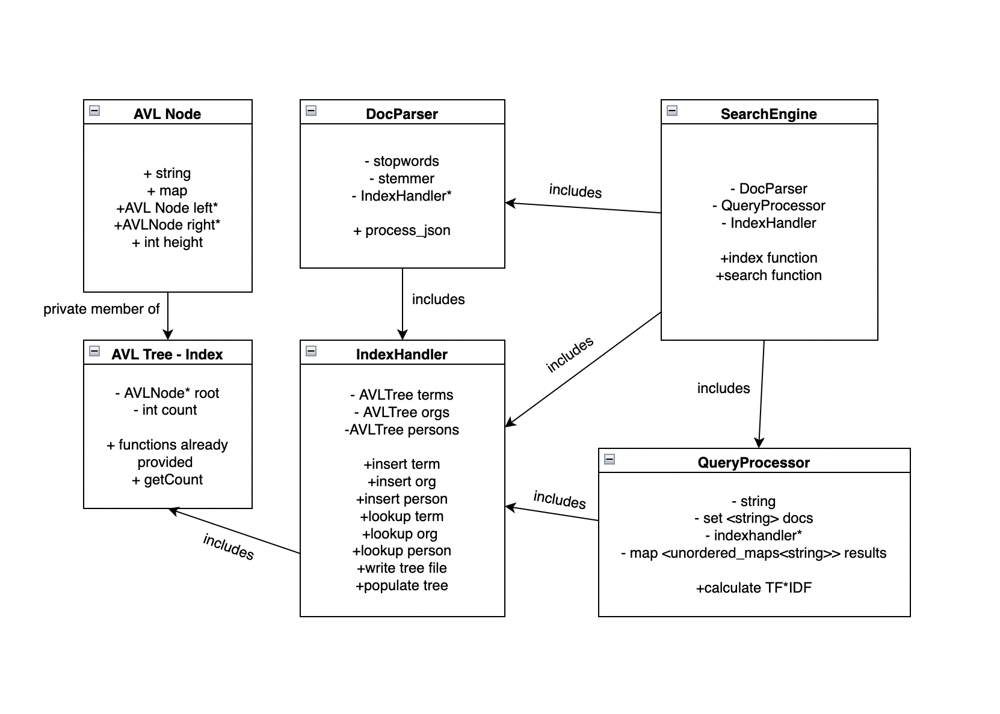

# Short Design Document
Group: Daja White, Viviane Dantas dos Santos  
Due Date: Saturday, November 5, 2022  

## UML Diagram

## Class Descriptions
### AVLTree: 
> composed by nodes(words). We can add nodes to it, sort them and look up words in it and its data like in what documents it 
appears and how many times. 

### AVLNode: 
> contain a string and a map that contains the data (documents and frequency).

### DocParser: 
> reads the documents, finds each word, and give the words to the index Handler.

### IndexHandler: 
> creates the index which is an AVL Tree, looks up words in the index and finds documents that the words are in
and gives back words information to QueryProcesser. 

### QueryProcessor: 
> take a query, split it up, look up each word using Index Handler, calculate TD IDF, find the intersection between the sets then return the results (documents) in order.

### SearchEngine: 
> reads a query and manages the connection between DocParser, QueryProcessor and IndexHandler.

## Class Interactions
### Create an index  
The search engine, which houses the UI, will pass a directory to DocParser. The DocParser processes every file from a directory. It removes stop words, and stems words. Every necessary word in the article text, and organization and author from the metadata found by the DocParser is given to IndexHandler. IndexHandler updates the indices accordingly. Indices are updated by either adding a document to an existing word/org/person map, or by creating a unique entry.  
### Perform a query
The search engine gets a query from the user and passes the query to QueryProcessor. The query is parsed and the conditions are searched via the IndexHandler. The IndexHandler gives QueryProcessor the results via a set. The QueryProcessor finds the intersection, difference, or negation accordingly and puts these ranked results in a new map. The new map is given to the search engine which will output the top 15 results.

## Implementation Timeline
| Task        | Planned completion | Actual completion | Time spent in hrs by Daja | Time spent in hrs by Viviane |
| ----------- | :-----------------:| :---------------: | :--------------------: | :--------------------: |
| UML Diagram           | Nov 4              |             |                     |                       |
| Adapt AVL Tree| Nov 6 | | |
| Implement DocParser | Nov 8 | | |
| Successfully create indices | Nov 10 | | |
| Implement IndexHandler | Nov 14 | | | 
| Implement Persistence Mechanism | Nov 16 | | |
| Implement QueryProcessor | Nov 16 | | |
| Implement User Interface | Nov 18 | | |
| Search Engine fully functional! | Nov 24 | | | 
| Implement Bonuses | Nov 29 | | |
| Clean up code & documentation | Nov 30 | | |
